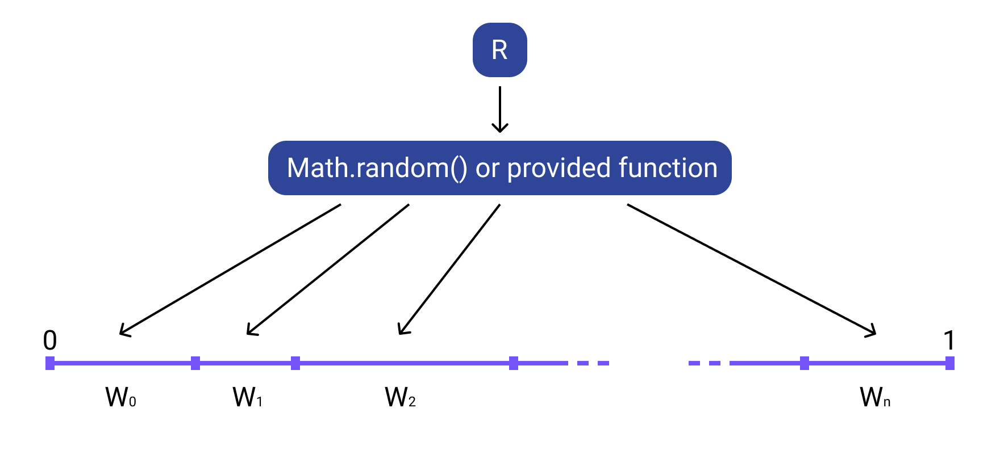

# @sharadbrat/randomizer

Tiny library that provides simple API for weighted random. It works like that:



## Start

Install dependency:

`npm install @sharadbrat/randomizer`

Import in project:

```javascript
import Randomizer from '@sharadbrat/randomizer';
```

Use:

```javascript
const r = new Randomizer([
  [1, 'A'],
  [1, 'B'],
  [1, 'C'],
]);

r.choose(); // will be 'A', 'B', or 'C' with equal probability
```

## Examples

Weights define the probability, according to this formula: `{weight} / {sum_of_weights}`

```javascript
const r = new Randomizer([
  [1, 'A'],
  [3, 'B'],
]);

r.choose(); // will be 'A' with 0.25 probability or 'B' with 0.75 probability
```

## Testing

`npm run test`

Runs tests with mocha.

## Authors

[sharadbrat](https://github.com/sharadbrat)


## License

MIT
